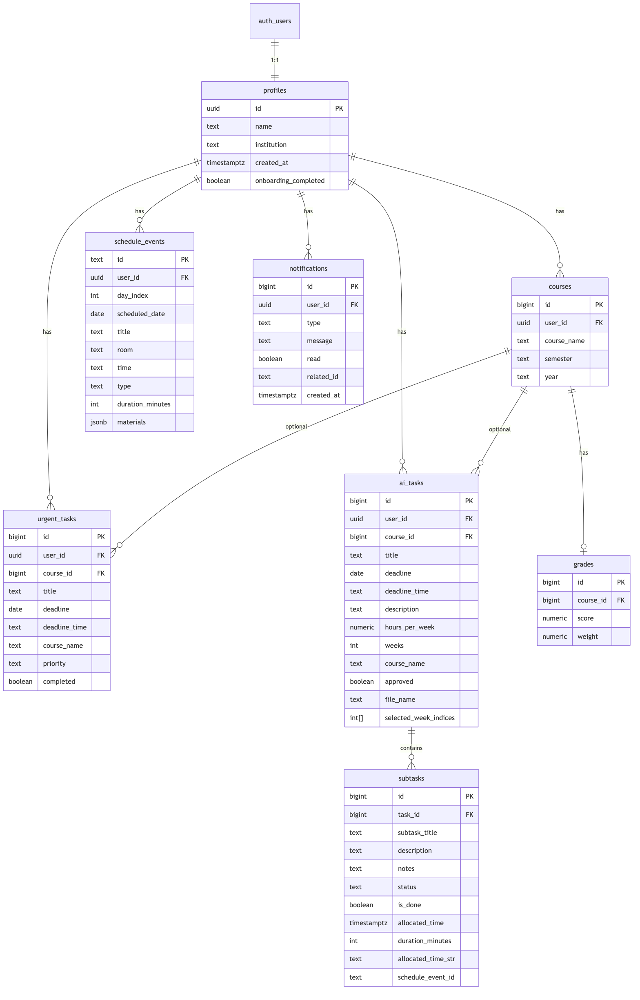

# lazy

פרויקט מסכם — פיתוח אתרים

**אתר חי:** _[https://lazy-psi.vercel.app/]_

---

## על האפליקציה

**Lazy** היא אפליקציית ניהול לימודים לסטודנטים — מרכזת במקום אחד משימות, מערכת שעות וציונים. בנויה mobile-first בעברית (RTL), עם ניווט תחתון בין ארבעה עמודים.

### הבעיה

סטודנטים מנהלים מטלות ארוכות, דדליינים, מערכת שעות וציונים בכלים נפרדים (יומן, נוטס, אקסל, וואטסאפ). התוצאה: עומס קוגניטיבי, קושי לפרק פרויקט גדול לשבועות עבודה, וסיכון לאבד משימות דחופות.

### קהל היעד

סטודנטים אקדמיים בישראל (בעיקר תואר ראשון) שצריכים ממשק עברי RTL לניהול מטלות סמסטריאליות, מעקב ציונים, ותכנון השבוע סביב מערכת שעות — בלי תלות בפורטל מוסדי ספציפי.

### למה Lazy, ולמה ככה

המוצר נבנה כי אין כלי אחד שמשלב את שלושת עמודי התווך של היום-יום האקדמי. לכן Lazy ממוקדת בצומת הזה בלבד: **פירוק מטלות + שיבוץ בלוח**, **מערכת שעות אישית**, ו**מעקב ציונים לפי נק״ז** — בממשק עברי mobile-first, מוכן לשימוש בלי הגדרות מורכבות.

### סקר שוק ובידול

סטודנטים בישראל נשענים על כלים מפוצלים: Google Calendar, Todoist / Notion, Excel לציונים, ו-WhatsApp לדדליינים. כלים בינלאומיים לסטודנטים (כמו MyStudyLife) חזקים באנגלית אבל חלשים ב-RTL ובציונים משוקללים; פורטלים מוסדיים (Moodle) נותנים ציונים רשמיים אבל לא תכנון אישי של זמן עבודה.

| כלי | חוזקות | חולשות מול הצורך האקדמי |
|-----|--------|-------------------------|
| **Google Calendar** | נפוץ, סנכרון, תזכורות | אין פירוק מטלות, אין ציונים |
| **Todoist / Notion** | רשימות ותבניות גמישות | לא מחובר למערכת שעות/ציונים; דורש הגדרה ידנית |
| **MyStudyLife וכדומה** | מערכת שעות + מטלות | אנגלית, לא RTL, בלי ממוצע לפי נק״ז |
| **פורטלים מוסדיים** | ציונים רשמיים, חומרי קורס | לרוב קריאה בלבד; אין תכנון אישי |

**בידול Lazy** — מרכז שליטה אקדמי אחד, לא עוד יומן או רשימה:

1. **פירוק מטלות חכם** — מטלה גדולה מתפרקת לשלבים לפי דדליין ושעות פנויות, כולל שיבוץ בלוח (וגם העלאת Word/PDF לחילוץ משימות).
2. **מערכת שעות + משימות באותו מקום** — שיעורים, מבחנים ואירועים לצד תכנון העבודה.
3. **ציונים וממוצע לפי נק״ז** — לפי סמסטר ושנה, בלי Excel נפרד.
4. **עברית RTL, mobile-first** — מותאם לסטודנט ישראלי, לא תרגום של כלי בינלאומי.

| יכולת | Lazy | יומן כללי | Notion / Todoist | פורטל מכללה |
|-------|:----:|:---------:|:----------------:|:-----------:|
| מערכת שעות | ✅ | ✅ | חלקי | ✅ |
| פירוק מטלה + שיבוץ | ✅ | ❌ | ידני | ❌ |
| העלאת מסמך לחילוץ משימות | ✅ | ❌ | ❌ | ❌ |
| ציונים וממוצע | ✅ | ❌ | תבנית | ✅ (רשמי) |
| עברית RTL מלא | ✅ | חלקי | חלקי | ✅ |
| בלי תלות במוסד | ✅ | ✅ | ✅ | ❌ |

**מסקנה:** השוק חזק בכל תחום בנפרד, אבל חסר פתרון ממוקד לסטודנט הישראלי שמשלב תכנון מטלות, לוח וציונים. Lazy ממלאת בדיוק את הפער הזה.

### מה אפשר לעשות

- **דף הבית** — התקדמות שבועית, השיעור והמבחן הקרובים, משימות דחופות.
- **AI Tasks** — פירוק משימות גדולות לשלבים, שיבוץ בלוח זמנים, מעקב התקדמות. הזנה ידנית או העלאת Word / PDF / TXT לחילוץ משימות מהמסמך, וזיהוי אוטומטי של כותרת המטלה. כולל פירוק חכם באמצעות **Cohere API** (דרך Supabase Edge Function).
- **מערכת שעות** — לוח שבועי וחודשי, הוספה ועריכה של שיעורים, מבחנים ואירועים.
- **ציונים** — רישום קורסים, נקודות זכות וציון, חישוב ממוצע לפי סמסטר ושנה.

### איך זה עובד (טכנולוגית)

- **פרונט:** React 18 + Vite, React Router, Context API.
- **בקאנד:** Supabase (PostgreSQL + Auth + RLS).
- **אחסון:** כש-Supabase מוגדר — נתונים בטבלאות מנורמלות; אחרת fallback ל-localStorage (פיתוח מקומי).
- **פירוק משימות:** לוגיקה מקומית (heuristics + זיהוי מבנה/כותרת מסמך) **וגם** פירוק חכם באמצעות Cohere API (דרך Supabase Edge Function — המפתח נשמר בצד השרת).
- **קבצים:** `mammoth` (Word), `pdfjs-dist` (PDF) — עיבוד בצד הלקוח בלבד.

---

## חשבון דמו

נתוני הדמו (קורסים, ציונים, משימות, מערכת שעות) **כלולים בקוד האפליקציה** — כל מבקר באתר רואה את אותם נתונים לדוגמה בלחיצה על **«כניסת דמו»** במסך ההתחברות. בכל כניסה לדמו הנתונים נטענים מחדש במלואם.

| שדה | ערך |
|-----|-----|
| אימייל | `dana@university.ac.il` |
| סיסמה | `1234` |

חשבון הדמו מיועד להדגמה והצגה. משתמשים אמיתיים נרשמים בנפרד ונשמרים ב-Supabase.

---

## הרצה מקומית

```bash
cd my-academic-app
npm install
cp .env.example .env.local   # אופציונלי — לחיבור Supabase
npm run dev
```

פתחי: http://localhost:5173 (מומלץ במצב מובייל / DevTools)

### חיבור Supabase

1. צרי פרויקט ב-[supabase.com](https://supabase.com)
2. הריצי את `supabase/schema.sql` ב-SQL Editor
3. העתיקי URL ו-anon key ל-`.env.local`
4. הפעילי מחדש `npm run dev`

### הגדרת Edge Function (Cohere)

לפירוק חכם של מטלות באמצעות Cohere:

1. התקיני את Supabase CLI: `brew install supabase/tap/supabase`
2. צרי פרויקט מקומי: `supabase link --project-ref YOUR_PROJECT_REF`
3. הגדרי מפתח Cohere: `supabase secrets set COHERE_API_KEY=...`
4. פרסי את ה-Edge Function: `supabase functions deploy parse-task`
5. ה-Edge Function תיקרא אוטומטית מהלקוח כשמשתמשים בלחצן "🧠 פירוק חכם עם AI" (אחרי בחירת אופן פירוק "AI")

> **חשוב:** מפתח ה-Cohere נשמר רק ב-Supabase Secrets ולא מגיע לצד הלקוח ולא לקוד המקור.

---

## דיפלוימנט (Vercel)

1. חברי את ה-repo ל-[Vercel](https://vercel.com)
2. **Root Directory:** `my-academic-app`
3. **Environment Variables:** `VITE_SUPABASE_URL`, `VITE_SUPABASE_ANON_KEY`
4. Deploy — Vercel מריץ `npm run build` אוטומטית

קובץ `vercel.json` מגדיר rewrite ל-SPA routing.

---

## עמודים

| עמוד | Route |
|------|-------|
| בית (Home) | `/` |
| AI Tasks | `/tasks` |
| מערכת שעות | `/schedule` |
| ציונים | `/grades` |

---

## שירותים חיצוניים

| שירות | סוג | שימוש |
|-------|------|--------|
| **Supabase** | Auth + Database (PostgreSQL) | אוטנטיקציה (אימייל + Google OAuth), אחסון נתונים, RLS, Edge Functions |
| **Cohere** | External API (Chat, `command-r-08-2024`) | פירוק חכם של מטלות אקדמיות לשלבי עבודה (דרך Supabase Edge Function) |
| **Supabase Edge Function** | Serverless Function | הרצת קריאה מאובטחת ל-Cohere API (מפתח ה-API נשמר בצד השרת) |
| **Vercel** | Hosting | דיפלוימנט והרצת האפליקציה |
| **Google Fonts** | External resource | גופנים Heebo + Plus Jakarta Sans |
| **mammoth** | Client library | חילוץ טקסט מקבצי Word (.docx) |
| **pdfjs-dist** | Client library | חילוץ טקסט מקבצי PDF |
| **GSAP** | Client library | אנימציות בדף הבית |

מפתחות Supabase ו-Cohere נשמרים ב-`.env.local` / משתני סביבה ב-Vercel / Supabase Secrets — **לא** בקוד המקור. מפתח ה-Cohere בפרט קיים **רק** כ-Supabase secret בצד השרת ואינו נחשף ללקוח בשום שלב.

---

## מודל נתונים (ERD)



תרשים מלא: [`docs/ERD.md`](docs/ERD.md)  
סכמת SQL: [`supabase/schema.sql`](supabase/schema.sql)

---

## מבנה הפרויקט

```
lazy/
├── README.md
├── docs/ERD.md
├── supabase/schema.sql
└── my-academic-app/
    ├── DESIGN.md
    ├── vercel.json
    ├── .env.example
    └── src/
        ├── components/   # AppHeader, BottomNav, Modal…
        ├── pages/        # Dashboard, Tasks, Schedule, Grades
        ├── context/      # AppContext — state גלובלי
        ├── lib/          # Supabase client
        ├── services/     # auth + sync ל-Supabase
        └── utils/        # לוגיקת משימות, ציונים, לוח שנה
```

---

## שמירת שינויים ב-Git (GitHub)

```bash
git status
git add .
git commit -m "תיאור קצר של מה ששינית"
git push origin main
```

| פקודה | במילים פשוטות |
|-------|----------------|
| `git status` | מראה אילו קבצים שינית |
| `git add .` | מוסיפה את כל השינויים ל-staging |
| `git commit -m "..."` | שומרת snapshot עם הודעה |
| `git push origin main` | שולחת ל-GitHub |

> לפני `git push` — `git pull origin main` אם עובדים בצוות.

**GitHub:** https://github.com/estersahno1/lazy
