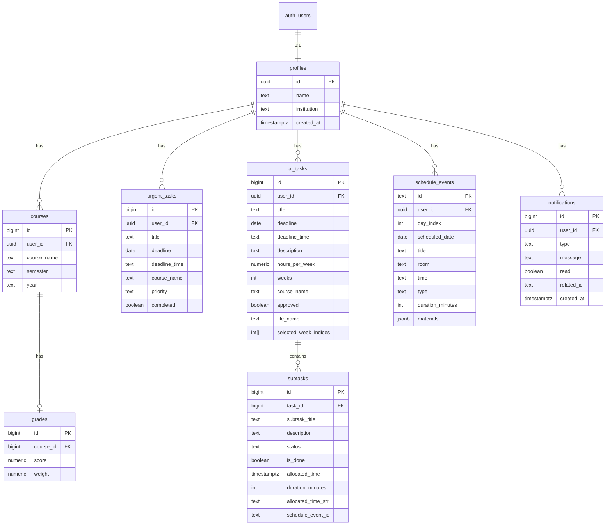

# ERD — Lazy

תרשים ישויות-קשרים למודל הנתונים ב-Supabase. המבנה תואם ל-`supabase/schema.sql` ולישויות שבשימוש באפליקציה.

## תרשים

## הסבר קצר על הקשרים

| ישות | תיאור |
|------|--------|
| **profiles** | פרופיל סטודנט — מקושר 1:1 ל-`auth.users` של Supabase Auth |
| **courses** | קורסים לפי סמסטר ושנה |
| **grades** | ציון ונקודות זכות לכל קורס (1:1) |
| **urgent_tasks** | משימות דחופות בדף הבית |
| **ai_tasks** | משימות גדולות שעוברות פירוק לשלבים |
| **subtasks** | שלבי ביצוע של משימת AI, כולל שיבוץ ביומן |
| **schedule_events** | שיעורים, מבחנים ואירועים במערכת השעות |
| **notifications** | התראות שנוצרות ממשימות, מבחנים ושלבים |

## אבטחה (RLS)

כל הטבלאות מוגנות ב-Row Level Security: משתמש רואה ומשנה **רק** שורות ש-`user_id` שלהן שווה ל-`auth.uid()`.

פרטים מלאים ב-`supabase/schema.sql`.
